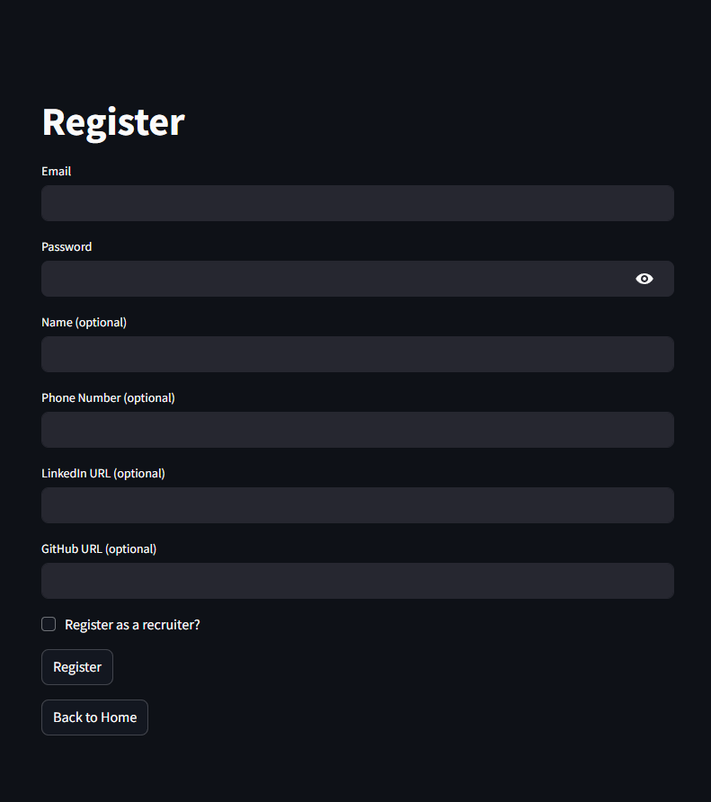

# AI-Powered Job Application Assistant

A **LangChain**-based app using **OpenAI**, **Pinecone**, and **FastAPI** to compare resumes with job descriptions, generate tailored cover letters, and perform recruiter-driven candidate search via **RAG**. Features include **Streamlit** UI, **JWT auth** and **PostgreSQL**.  

---

## Contents

- [Features](#features)
- [Tech Stack](#tech-stack)
- [Usage](#usage)
- [How to Install](#how-to-install)
- [Development](#development)
- [Testing](#testing)
- [License](#license)

---

## Features

- Use the power of **OpenAI LLMs** to:
    1. Extract key details from job descriptions or resumes.
    2. Compare resumes to job descriptions and calculate a match score.
    3. Generate personalized cover letters based on job descriptions with custom guidelines.
- **RAG** using Pinecone Vector Store, enabling recruiters to find the ideal candidates with a single click.
- **Secure login and account management** using JWT tokens.
- **Data storage** in a PostgreSQL database to securely save user information.
- Simple and user-friendly interface built with Streamlit.
- **Dockerized** for fast and easy deployment.
---

## Tech Stack

- **Backend**: FastAPI, SQLAlchemy, Alembic
- **Frontend**: Streamlit
- **AI**: LangChain, OpenAI API
- **Vector Database**: Pinecone
- **Database**: PostgreSQL
- **Authentication**: JWT (JSON Web Tokens)
- **Containerization**: Docker
- **Testing**: Pytest
- **Environment Management**: Python 3.11+

---

## Usage

- Visit the home page to signup or login


- Register as a user or a recruiter



- Upload your resume or update your info


Recruiters have an extra tab!


- Analyse jobs and see compatibility with your resume


- Generate a cover letter with custom guidelines


- See key details of a resume


-  Find ideal candidates (only for recruiters)


---

## How to Install

1. Clone the repository
```bash
git clone https://github.com/idalz/ai-powered-job-app-assistant.git
```
2. Create a virtual environment
```bash
python -m venv venv
source venv/bin/activate  # On Windows: venv\Scripts\activate
```

3. Install dependencies
```bash 
pip install -r requirements.backend.txt
pip install -r requirements.frontend.txt
```

4. Set up environment variables (root folder)
- `.env`
```
OPENAI_API_KEY=<your-openai-api-key>
PINECONE_API_KEY=<your-pinecone-api-key>
PINECONE_INDEX_NAME=<your-pinecone-index-name>
API_URL=http://localhost:8000/api/v1/endpoints/
DATABASE_URL=postgresql://<your-username>:<your-password>@db/job_app_db
SECRET_KEY=<your-jwt-secret-key>
```
- `.env.db`
```
POSTGRES_USER=<your-username>
POSTGRES_PASSWORD=<your-password>
POSTGRES_DB=job_app_db
``` 

5. Docker Setup:

Run the following command to start the application and database container:
```bash
docker-compose up --build
```
This  will  build and start all the containers(backend, frontend, db), persist data in a Docker volume so database content is saved and run Alembic Migrations automatically!

6. The application will run at http://localhost:8501

---
## Development

If you'd like to run locally (without Docker), follow the instruction above. Also:

1. Run `alembic` Migrations Locally:
```bash
alembic upgrade head
```

2. Run the `FastAPI` app:
```bash
uvicorn app.main:app --reload
```

3. Run the `streamlit` app:
```bash
streamlit run streamlit_app/main.py
```

You may need to change the `DATABASE_URL` to `localhost`:
```
DATABASE_URL=postgresql://<your-username>:<your-password>@localhost/job_app_db
...
```

---
## Testing 

If you would like to run tests, ensure you installed `pytest`:
```bash
pip install pytest
```

Currently, tests are not connected to a database.. Run only input/output tests for endpoints and llm tests.

---
## License
This project is licensed under the [MIT License](LICENSE).
